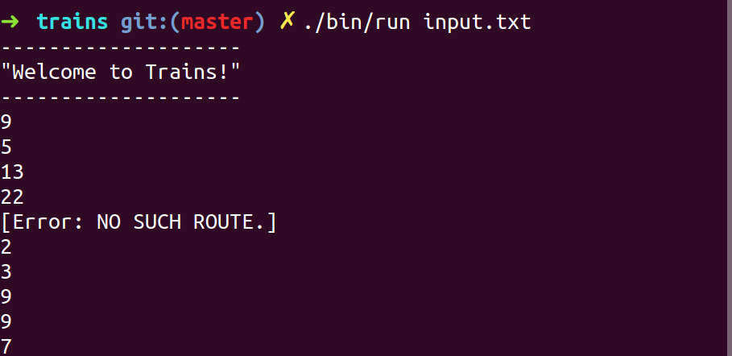

Problem one:
------------

### Trains:

The local commuter railroad services a number of towns in Kiwiland.  Because of monetary concerns, all of the tracks are 'one-way.'  That is, a route from Kaitaia to Invercargill does not imply the existence of a route from Invercargill to Kaitaia.  In fact, even if both of these routes do happen to exist, they are distinct and are not necessarily the same distance!

The purpose of this problem is to help the railroad provide its customers with information about the routes.  In particular, you will compute the distance along a certain route, the number of different routes between two towns, and the shortest route between two towns.

Implementation:
---------------

At it's core, Trains is a Directed Graph (Digraph) with an Adjacency List implementation.  Trains was written entirely in JavaScript using the Node.js runtime.  I chose a command line application with strictly synchronous functions to demonstrate JavaScript's ability to run as a systems language.  I followed TDD principles, focusing mainly on KISS and the single responsibility principle.  Git and GitHub were used for versioning, and Wercker was used for CI.  I did not deviate from JavaScript's prototypal inheritance model.

### Design choices and assumptions:

A generic digraph (digraph.js) implementation sits at the core with an application wrapper (app.js) reading in an input file and instantiating an instance of said digraph.

The digraph's vertices are nodes (node.js), and it's edges are routes (route.js).  Each node has a JavaScript map using node names as keys and route objects as values, to represent it's adjacency list.  The digraph  implements a basic depth first traversal (that is O(V + E)) for retrieving all paths from source to destination node with a defined bound.  The application wrapper makes calls to it's digraph instance to achieve most of the functionality outlined in the ThoughtWorks problem specification.

Future work:
------------

- Extend synchronous functions with asynchronous variants and expose via REST API.
- Run code through lint
- Better error handling
- More edge case  tests
- Default argument values
- Shortest path algorithm (Dijkstra)

How to run:
-----------

1. Install latest Node.js for your platform
2. Install jasmine-node globally: `$> npm install -g jasmine-node`
3. Run tests: `$> npm test`
4. Run runner: `$> ./bin/run input.txt` or   `$> ./bin/run --help`

### Sample output:

Licence:
-------

> The MIT License (MIT)

> Copyright (c) 2016 James Fraser

> Permission is hereby granted, free of charge, to any person obtaining a copy
of this software and associated documentation files (the "Software"), to deal
in the Software without restriction, including without limitation the rights
to use, copy, modify, merge, publish, distribute, sublicense, and/or sell
copies of the Software, and to permit persons to whom the Software is
furnished to do so, subject to the following conditions:

> The above copyright notice and this permission notice shall be included in all
copies or substantial portions of the Software.

> THE SOFTWARE IS PROVIDED "AS IS", WITHOUT WARRANTY OF ANY KIND, EXPRESS OR
IMPLIED, INCLUDING BUT NOT LIMITED TO THE WARRANTIES OF MERCHANTABILITY,
FITNESS FOR A PARTICULAR PURPOSE AND NONINFRINGEMENT. IN NO EVENT SHALL THE
AUTHORS OR COPYRIGHT HOLDERS BE LIABLE FOR ANY CLAIM, DAMAGES OR OTHER
LIABILITY, WHETHER IN AN ACTION OF CONTRACT, TORT OR OTHERWISE, ARISING FROM,
OUT OF OR IN CONNECTION WITH THE SOFTWARE OR THE USE OR OTHER DEALINGS IN THE
SOFTWARE.